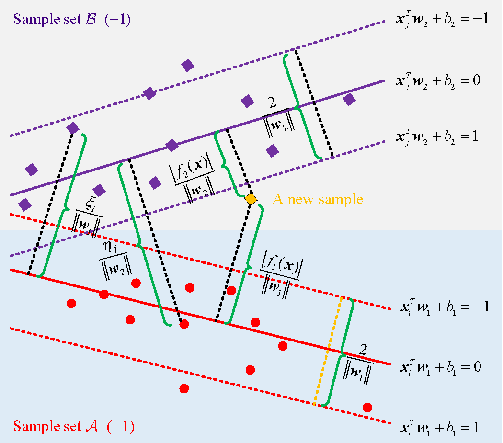
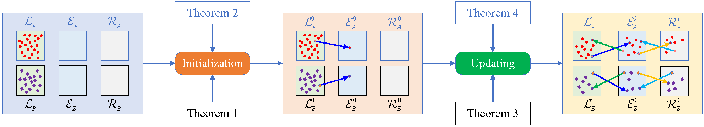
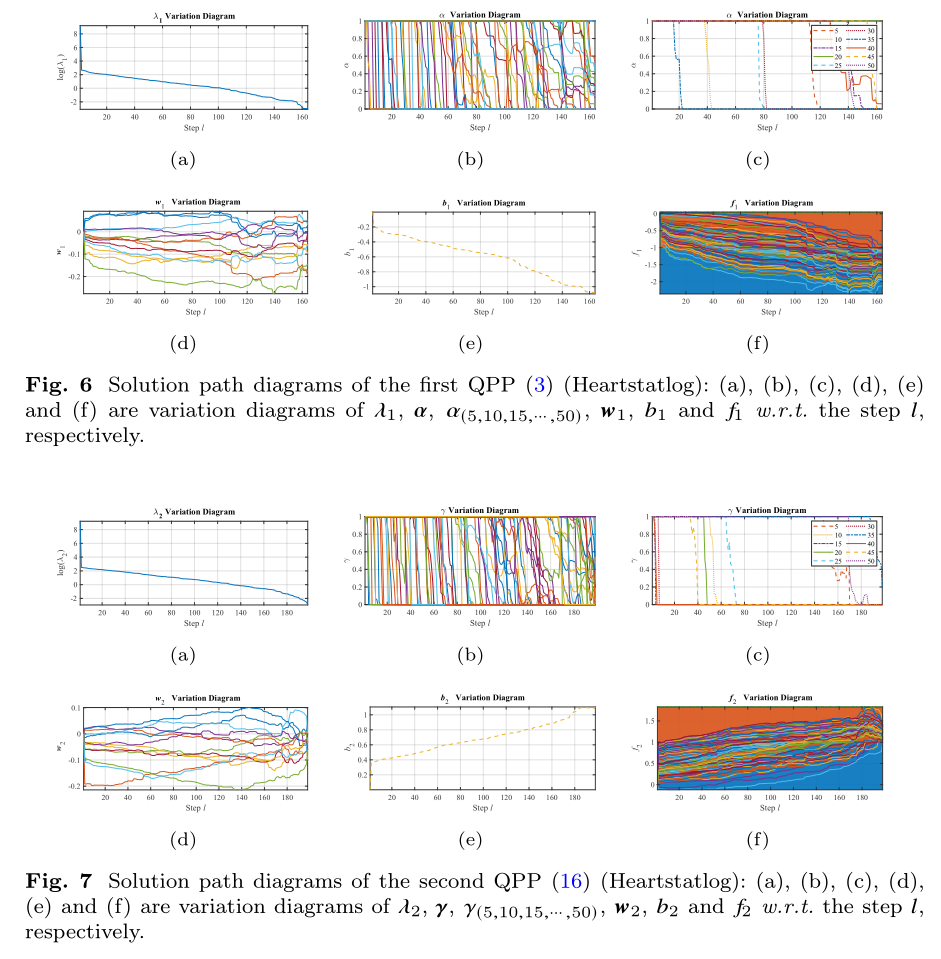

# TSVMPath: Fast Regularization Parameter Tuning Algorithm for Twin Support Vector Machin

The implementation of Fast Regularization Parameter Tuning Algorithm for Twin Support Vector Machine.

## Abstract

Twin support vector machine (TSVM) has attracted much attention in the field of machine learning with good generalization ability and computational performance.　However, the conventional grid search method is very time-consuming to obtain the optimal regularization parameter. To address this problem, we develop a novel fast regularization parameter tuning algorithm for TSVM, named TSVMPath. After transforming the models of two sub-optimization problems, we divide the two classes of samples into different sets. Lagrangian multipliers are then proved to be piecewise linear concerning the corresponding regularization parameters, greatly extending the search space of the solution. By proving that the Lagrangian multipliers of two sub-optimization models are 1 when the regularization parameters approach infinity, we design a simple yet effective initialization. As a result, the entirely regularized solution path can be obtained without solving quadratic programming problems. Four types of events are finally defined to update the solution path. Experiments on 8 UCI datasets show that both the prediction accuracy of TSVMPath is superior to the best competing methods, with up to four orders of magnitude speed-up for the computational overhead compared with the grid search method.

## TSVM

Illustration of TSVM: the red circle samples is in the set $\mathcal{A}$, marked as $+1$, the violet square samples are in the set $\mathcal{B}$, marked as $-1$, and solid lines in red and violet represent two nonparallel hyperplanes, respectively. In addition, the distance from the sample to the hyperplane is also indicated in the figure. 

## Framework

Flowchart of the proposed fast regularization parameter tuning algorithm for TSVM (TSVMPath). It mainly consists of two steps: initialization as shown in Algorithm 1 and updating as shown in Algorithm 2, where the initialization aims to assign initial values to parameters by solving event 1 and the updating process aims to find out the entire solution path by reducing the value of the regularization parameter.

## Results

## Contact

Feel free to contact me with `zhoukanglei[at]qq.com`
